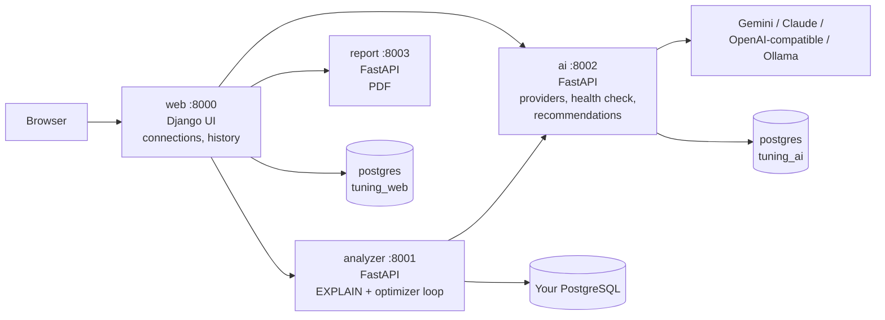
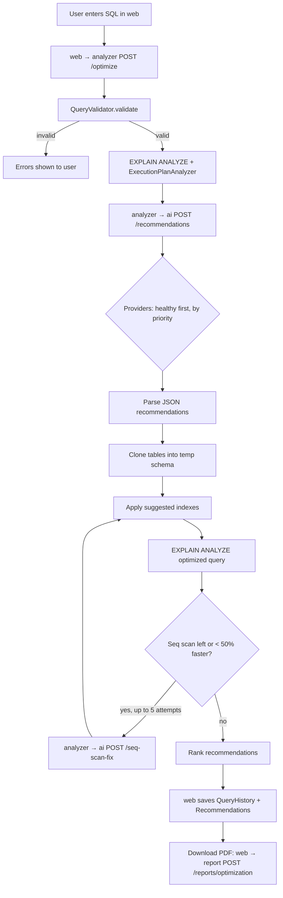

# PostgreSQL Query Tuning Advisor 🚀

AI-powered query optimization for PostgreSQL. Tuning Buddy analyzes your SQL queries, gets optimization recommendations from the AI provider **you** configure, and tests them automatically on temporary copies of your tables.

It runs locally as a set of Docker microservices.

## Features

- 🔍 **Query Analysis** - Run EXPLAIN ANALYZE and get detailed execution plans
- 🤖 **Configurable AI** - Add Google Gemini, Anthropic Claude, or any OpenAI-compatible API (OpenAI, DeepSeek, Groq, OpenRouter, local Ollama / LM Studio) from the UI, with priority-based fallback
- ✅ **AI Health Check** - Every provider is verified before use; the app unlocks only when at least one provider passes
- 🧪 **Automatic Testing** - Test recommendations using temporary schemas
- 📊 **Performance Comparison** - Compare execution times before and after optimization
- 📄 **PDF Reports** - Download a report for every analysis
- 🔒 **Secure Storage** - Database credentials and API keys are encrypted

## Architecture



| Service | Tech | Port | Responsibility | Data |
|---------|------|------|----------------|------|
| `web` | Django 4.2 + gunicorn | `8000` | UI, connections, query history, AI gate | `tuning_web` DB |
| `analyzer` | FastAPI | `8001` (localhost only) | Validate SQL, EXPLAIN ANALYZE, test recommendations in temp schemas | stateless |
| `ai` | FastAPI + SQLAlchemy | `8002` (localhost only) | AI provider settings, health checks, recommendations with fallback | `tuning_ai` DB |
| `report` | FastAPI + ReportLab | `8003` (localhost only) | PDF report generation | stateless |
| `postgres` | PostgreSQL 16 | internal | App database (one DB per service) | volume `postgres-data` |
| `ollama` *(profile)* | Ollama | `11434` | Optional local LLMs | volume `ollama-models` |
| `sampledb` *(profile)* | PostgreSQL 16 + PostGIS + pgvector | `5433` | Optional demo database seeded from `infra/sampledb/init/` (shop, 1M rows, PostGIS, pgvector) | - |

Each FastAPI service documents its API at `/docs`, e.g. http://localhost:8002/docs.

## Quick Start

Requirements: [Docker Desktop](https://www.docker.com/products/docker-desktop/) (includes Docker Compose).

```bash
# 1. Create your environment file
cp .env.example .env

# 2. Generate the two keys and paste them into .env
python -c "import secrets; print(secrets.token_urlsafe(50))"                                  # SECRET_KEY
python -c "from cryptography.fernet import Fernet; print(Fernet.generate_key().decode())"    # ENCRYPTION_KEY

# 3. Build and start everything (add --profile demo for a sample database)
docker compose --profile demo up --build -d

# 4. Check that all services are healthy
docker compose ps
```

Open **http://localhost:8000**.

### First run: configure AI

Until an AI provider is verified, every page redirects to **AI Settings**.

1. Click **Add Provider**.
2. Choose a type:
   - **Google Gemini**: API key + model (e.g. `gemini-2.0-flash`)
   - **Anthropic Claude**: API key + model (default `claude-opus-5`)
   - **OpenAI-compatible**: base URL + model (+ API key if the server needs one). Presets are provided for DeepSeek, Groq, OpenAI, OpenRouter and Ollama.
3. Click **Test connection** to try the settings before saving, or **Save & check**.

The health check sends a tiny prompt and requires the model to reply with valid JSON. That verifies the API key, model access, network reachability, and JSON output, which the optimizer depends on. Failures are explained (invalid key, model not found, quota exceeded, host unreachable, invalid JSON).

**Fallback:** during analysis, enabled providers are tried healthy-first, then by priority (lower number first). If a provider fails at runtime it is marked unhealthy; if no healthy provider is left, the app locks again until one passes a check.

For Claude Opus 5 / Fable 5.1, the AI service enables Anthropic's server-side refusal fallback (`fallbacks: "default"`), so a declined request is retried on a fallback model within the same call.

### Local models with Ollama

```bash
docker compose --profile ollama up -d
docker compose exec ollama ollama pull llama3.2
```

Add an **OpenAI-compatible** provider with base URL `http://ollama:11434/v1` and model `llama3.2` (no API key).

An Ollama or LM Studio server already running on your computer is reachable at `http://host.docker.internal:<port>/v1`.

### Analyzing a database

- **Demo database** (`--profile demo`): host `sampledb`, port `5432`, database `shop`, user `demo`, password `demo`.
- **A database on your computer**: host `host.docker.internal` (not `localhost`, which is the analyzer container itself).
- **A remote database**: its normal hostname.

**Safety:** recommendations are only ever applied to a temporary schema cloned from your tables, which is dropped afterwards. Every `CREATE INDEX` is rewritten to target that schema and refused if it cannot be; anything that is not a single `CREATE INDEX` (an `ALTER TABLE`, a chained `DROP`, and so on) is rejected outright, so an AI suggestion can never modify the database you are analyzing. Clones are `ANALYZE`d after loading and after each index, so before/after plans are compared on real statistics.

## Application Logic Flow



| Step | Service | File |
|------|---------|------|
| HTTP handling, persistence, AI gate | web | `services/web/advisor/views.py`, `middleware.py` |
| SQL validation, plan analysis | analyzer | `services/analyzer/app/query_analyzer.py` |
| DB access, temp schemas | analyzer | `services/analyzer/app/db_connector.py` |
| Optimization loop | analyzer | `services/analyzer/app/optimizer.py` |
| Prompts, parsing, fallback | ai | `services/ai/app/prompts.py`, `parsing.py`, `service.py` |
| Provider adapters | ai | `services/ai/app/providers/` |
| Health check | ai | `services/ai/app/health.py` |
| PDF | report | `services/report/app/pdf_generator.py` |

## Configuration

All settings live in `.env` (see `.env.example`):

| Variable | Description | Default |
|----------|-------------|---------|
| `SECRET_KEY` | Django secret key | **required** |
| `ENCRYPTION_KEY` | Fernet key for DB passwords and AI API keys. Keep it stable | **required** |
| `DEBUG` | Django debug mode | `False` |
| `POSTGRES_USER` / `POSTGRES_PASSWORD` | App database credentials | `tuning` / `tuning` |
| `QUERY_EXECUTION_TIMEOUT` | EXPLAIN ANALYZE timeout (seconds) | `300` |
| `AI_HEALTH_CHECK_TIMEOUT` | Health check timeout per provider (seconds) | `30` |
| `AI_REQUEST_TIMEOUT` | Recommendation timeout per provider (seconds) | `300` |

AI API keys are managed in the app, not in `.env`.

## Benchmark suite

A spread of query shapes - simple filters, joins, sorting, a pattern search nothing can
help, plus PostGIS and pgvector workloads - can be run through the real pipeline:

```bash
docker compose exec web python manage.py benchmark --list
docker compose exec web python manage.py benchmark --connection 1
```

Each case produces a normal analysis, readable and downloadable at `/results/<id>/`.
See [docs/REPORT_AND_TESTING.md](docs/REPORT_AND_TESTING.md) for the cases, the measurement
pipeline, the safety guarantees and the anatomy of the PDF report.

## Development

```bash
# Logs for one service
docker compose logs -f ai

# Run tests
docker compose run --rm ai pytest
docker compose run --rm web python manage.py test advisor

# Rebuild a single service after code changes
docker compose up --build -d analyzer
```

### Migrating data from the old Vercel deployment

The local database starts empty. To bring over connections and history, export from the old database with the **same** `ENCRYPTION_KEY`:

```bash
# against the old DATABASE_URL
python manage.py dumpdata advisor > advisor.json
# then
docker compose cp advisor.json web:/app/advisor.json
docker compose exec web python manage.py loaddata advisor.json
```

## Project Structure

```
tuning-buddy/
├── docker-compose.yml
├── .env.example
├── infra/
│   ├── postgres/init/        # creates tuning_web and tuning_ai
│   └── sampledb/             # demo data for --profile demo
└── services/
    ├── web/                  # Django UI (advisor app, templates, static)
    ├── analyzer/             # FastAPI: db_connector, query_analyzer, optimizer
    ├── ai/                   # FastAPI: providers, health check, prompts, tests
    └── report/               # FastAPI: PDF generator
```

## License

MIT License
