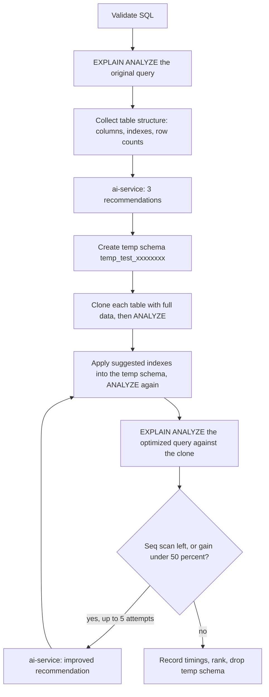

# The Report and the Testing Logic

How Tuning Buddy measures a recommendation, what guarantees it gives about your database,
and what the generated PDF contains.

- [How a recommendation is tested](#how-a-recommendation-is-tested)
- [Safety guarantees](#safety-guarantees)
- [Anatomy of the report](#anatomy-of-the-report)
- [Design system](#design-system)
- [Benchmark suite](#benchmark-suite)
- [Test suites](#test-suites)
- [Known limitations](#known-limitations)

---

## How a recommendation is tested

Every recommendation is measured, never guessed. The analyzer service runs this pipeline
(`services/analyzer/app/optimizer.py`):



**1. Validation.** `QueryValidator` accepts only `SELECT` and `WITH` queries and rejects
`DROP`, `DELETE`, `TRUNCATE`, `ALTER` and friends before anything touches the database.

**2. Baseline.** `EXPLAIN (ANALYZE, BUFFERS, FORMAT JSON)` under a statement timeout
(`QUERY_EXECUTION_TIMEOUT`, default 300s) produces the plan and the runtime every later
number is compared against.

**3. Recommendations.** The query, its plan, the detected issues and the table structure
go to the ai-service, which tries providers healthy-first then by priority and returns
three options.

**4. A disposable copy.** Each recommendation gets its own schema, `temp_test_<8 hex>`.
Tables are cloned with `LIKE ... INCLUDING DEFAULTS INCLUDING STORAGE` and the **full**
dataset is copied, so measurements reflect real data volumes.

**5. Statistics.** `ANALYZE` runs after the clone is loaded and again after each index.
Without this the planner estimates from nothing (`reltuples = 0`), picks bad plans, and
every recommendation looks catastrophically slower than the original.

**6. Applying indexes.** `qualify_index_statement()` rewrites the target of each
`CREATE INDEX` into the temp schema and refuses anything it cannot confine there. See
[Safety guarantees](#safety-guarantees).

**7. Measurement.** The optimized query is rewritten to reference the cloned tables and
measured with `EXPLAIN (ANALYZE)`. Every timing - the baseline included - is taken
`MEASUREMENT_REPEATS` times (default 3) and reduced to its **median**, keeping the spread
between repeats so the report can say how much the runs disagreed.

**7b. Significance.** A percentage on its own is not evidence, so each result is classified:

| Verdict | Meaning |
|---|---|
| `faster` | Beat the baseline by more than the spread between repeats |
| `slower` | Lost to the baseline by more than that spread |
| `within_noise` | The difference is smaller than the run-to-run variation |
| `already_fast` | The baseline is under `NOISE_FLOOR_MS` (default 5ms); nothing here can be proven to help |

Only a `faster` option can become the report's recommended action or contribute the
headline improvement figure. A baseline below the noise floor also stops the iteration
loop after one attempt, instead of spending five AI rounds chasing 50% of a fraction of a
millisecond.

**8. Iteration.** While a sequential scan survives or the gain is under 50%, the analyzer
asks for a better recommendation, up to 5 attempts per option. Indexes accumulate across
attempts, and the structure fed back to the AI is described using **your** table names, so
the throwaway schema never appears in anything you are told to run.

**9. Ranking and cleanup.** Options are ranked by sequential-scan elimination first, then
by improvement. The temp schema is dropped in a `finally` block, so it goes away even when
a step fails.

---

## Safety guarantees

The recommendations come from a language model, so the analyzer treats them as untrusted
input. Four rules hold:

| Guarantee | Enforced by |
|---|---|
| Only `CREATE INDEX` is ever executed | `qualify_index_statement()` rejects anything else, including `ALTER TABLE`, `DROP`, and `CREATE INDEX ...; DROP TABLE ...` chaining |
| Every index lands in the temp schema | The `ON` target is rewritten to `"temp_test_x"."table"`, then re-checked; a statement that cannot be confined is refused and logged |
| Your database is never modified | Only the temp schema is written to, and it is dropped afterwards |
| Saved analyses cannot be silently erased | `QueryHistory.connection` uses `on_delete=PROTECT`; deleting a connection with history is refused |

A refused statement appears in the analyzer log as
`Refused index statement (<reason>): <statement>`.

---

## Anatomy of the report

`services/report/app/pdf_generator.py`. The report is ordered so the first page answers
"what did we run, what should I do, and what does it buy me".

**Page 1 — summary**
1. Masthead: eyebrow label, title, database name and the time the **analysis** ran
2. Four headline figures: original runtime, best tested runtime, improvement, option count
3. The query under review
4. **Recommended action** — the exact DDL to apply and the measured gain, or an amber note
   when nothing beat the original
5. Execution time by option, as a bar chart

**Page 2 — evidence**
1. Current plan versus recommended plan: runtime, access method, planner cost, rows
2. **Plan flowchart** (see below)
3. A diagnosis callout explaining the access method in plain language
4. The plan tree in full

**One page per option**
1. Verdict table: runtime, versus current, sequential scan eliminated, tuning iterations
2. The indexes to apply
3. The optimized query, labelled "unchanged - indexes only" when the SQL itself did not change
4. The plan after the change, as diagram and tree

**Footer** — method note (temp-schema clone, colder cache), the AI provider and model, and
`page N of M` on every page.

### The plan flowchart

Plans are drawn as boxes connected by arrows, read **top to bottom**: the scans execute
first and each step feeds the one below, ending with the rows returned to the client.

| Colour | Meaning |
|---|---|
| Red top rule | Sequential scan |
| Green top rule | Index scan |
| Blue top rule | Join, aggregate, sort |
| Grey | Everything else |

A node is called out only when it owns **at least 40% of measured self time** (total time
minus its children, so a parent waiting on a slow child is not blamed):

- a dominant **sequential scan** is labelled `BOTTLENECK` in red
- any other dominant node is labelled `HIGHEST COST` in neutral grey
- on a recommendation page the callout is suppressed entirely unless a sequential scan
  survived, because an optimized plan has no bottleneck to report

Deep plans are capped at 12 nodes with a "showing first N nodes" note.

---

## Design system

Printed-report conventions: white page, navy ink, one accent blue, hairline rules.

| Token | Hex | Used for |
|---|---|---|
| `INK` | `#0B2545` | Headings, figures, box titles |
| `BODY` | `#1F2A37` | Body copy |
| `MUTED` | `#64748B` | Labels, captions, source notes |
| `ACCENT` | `#3B82F6` | Core accent, code rule, join nodes |
| `ACCENT_DEEP` | `#1D4ED8` | Eyebrow text, chart bars, masthead rule |
| `SUCCESS` | `#15803D` | Improvements, index scans |
| `DANGER` | `#B42318` | Regressions, sequential scans |
| `WARNING` | `#B54708` | "Nothing beat the original" |
| `RULE` | `#D7DEE8` | Hairlines, connectors |
| `SOFT` | `#F5F8FC` | Table headers, code panels |

Typography is a single family (Helvetica) on a tight scale: 21pt title, 12.5pt section
headings on a hairline rule, 9.5pt body at 14pt leading, 8pt uppercase micro-labels, 7pt
captions, Courier for SQL. Tables have no grid — hairlines only, numerals right-aligned.
Every figure carries a `Source:` note.

---

## Benchmark suite

A management command runs a spread of query shapes through the real pipeline, so each case
produces the same records the UI creates and is readable at `/results/<id>/`.

```bash
docker compose exec web python manage.py benchmark --list
docker compose exec web python manage.py benchmark --connection 1
docker compose exec web python manage.py benchmark --cases spatial-knn,vector-knn
docker compose exec web python manage.py benchmark --no-test     # recommendations only, faster
```

| Case | Exercises | Needs |
|---|---|---|
| `simple-pk` | Primary key lookup that is already optimal | - |
| `simple-filter` | Equality filter over 1M rows: sequential scan to b-tree | - |
| `range-filter` | Two predicates plus ordering | - |
| `join-aggregate` | Join, grouping, aggregation | - |
| `three-table-join` | Foreign key indexes across three tables | - |
| `sort-limit` | Top-N, where an index removes the sort | - |
| `like-wildcard` | Leading wildcard, which no b-tree can help | - |
| `spatial-knn` | Nearest neighbour, GiST | `postgis` |
| `spatial-radius` | `ST_DWithin` radius search | `postgis` |
| `vector-knn` | Similarity search, HNSW/IVFFlat | `vector` |
| `vector-filtered` | Similarity search with a filter | `vector` |

Cases whose extension is missing are skipped, not failed. The demo database
(`docker compose --profile demo up -d --build sampledb`) ships PostGIS and pgvector and
seeds: `customers`/`orders`/`products`/`order_items` (~5k rows), `large_orders` (1M rows),
`places` (200k points, no spatial index), `documents` (20k embeddings, no ANN index).

Seed scripts only run when the data directory is empty. Recreating the container is **not**
enough - the data volume survives it. To re-seed from scratch:

```bash
docker compose --profile demo down -v      # drops the demo data volume
docker compose --profile demo up -d sampledb
```

To load a single seed into a running database without wiping the rest:

```bash
docker compose exec -T sampledb psql -U demo -d shop -v ON_ERROR_STOP=1 \
  -f /docker-entrypoint-initdb.d/03_spatial.sql
```

`simple-pk` and `like-wildcard` are deliberately cases where the tool **should not** find a
win — a suite where everything improves is not testing the honesty of the measurement.

### Measured results

One uncontended run against the demo database, every timing the median of 3 repeats.
"Spread" is the difference between the fastest and slowest baseline repeat.

| Case | Original (median) | Spread | Best | Gain | Verdict |
|---|---|---|---|---|---|
| `simple-filter` | 62.7 ms | 17.1 ms | 0.110 ms | +99.8% | faster |
| `range-filter` | 90.6 ms | 19.0 ms | 0.319 ms | +99.6% | faster |
| `sort-limit` | 168.8 ms | 62.9 ms | 0.170 ms | +99.9% | faster |
| `spatial-knn` | 81.0 ms | 4.8 ms | 0.360 ms | +99.6% | faster |
| `spatial-radius` | 640.3 ms | 117.2 ms | 29.5 ms | +95.4% | faster |
| `vector-knn` | 8.8 ms | 8.1 ms | 0.176 ms | +98.0% | faster |
| `join-aggregate` | 0.554 ms | 0.30 ms | 0.589 ms | -6.3% | already_fast |
| `three-table-join` | 2.7 ms | 0.73 ms | 2.313 ms | +13.5% | already_fast |
| `vector-filtered` | 4.0 ms | 0.46 ms | 3.025 ms | +23.4% | already_fast |
| `like-wildcard` | 92.1 ms | 21.9 ms | 83.7 ms | +9.1% | within_noise |
| `simple-pk` | - | - | - | - | failed: AI response could not be parsed |

Read the spread column alongside the gain. `sort-limit` varied by 62.9 ms and
`spatial-radius` by 117.2 ms **between repeats of the same query**, so any single-run
measurement in that range is a coin toss - which is why medians and verdicts exist. The
six `faster` results are all on large tables where the effect dwarfs that variation; every
sub-5ms case is correctly reported as needing no action rather than given a flattering
percentage.

---

## Test suites

```bash
docker compose run --rm --no-deps analyzer pytest    # index safety, temp-schema sanitising
docker compose run --rm --no-deps report pytest      # rendering, flowchart, escaping
docker compose run --rm --no-deps ai pytest          # providers, health checks, fallback
docker compose exec web python manage.py test advisor
```

| Suite | Covers |
|---|---|
| analyzer | Rewriting every `CREATE INDEX` into the temp schema, refusing everything else, and rewriting temp-schema references back to real tables |
| report | Rendering with missing plans and untested options, escaping AI-written markup, plan-tree formatting, flowchart layout and bottleneck rules |
| ai | Provider CRUD, key masking, health-check classification, priority fallback, marking failed providers unhealthy |
| web | The AI-readiness gate, 503 handling, provider form validation |

---

## Known limitations

- **Colder cache.** A freshly cloned table has nothing in shared buffers, so absolute
  timings run slower than a warmed production table. Comparisons are like-for-like; the
  absolute numbers are not production numbers.
- **Clone cost.** Each option clones the full dataset. A 150MB table takes seconds; a very
  large table will take proportionally longer and needs the disk space.
- **The 50% goal is arbitrary.** On small tables a sequential scan is often already
  optimal, so the loop burns its five attempts chasing a target that cannot be met.
- **Password expiry.** Connection passwords expire after an hour; an analysis attempted
  after that is redirected to the edit form rather than run.
